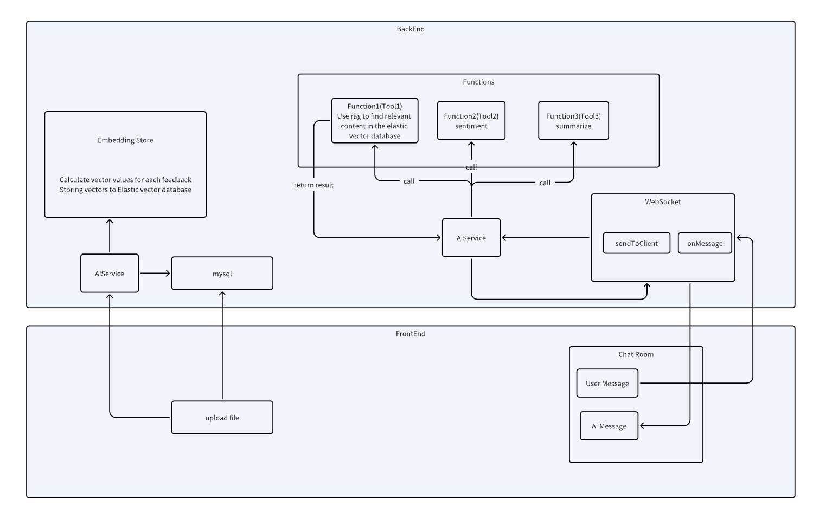
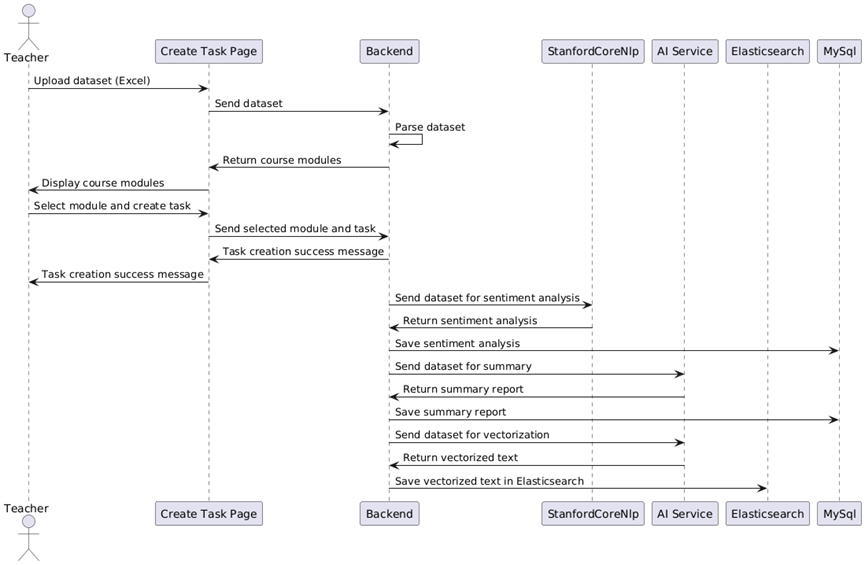
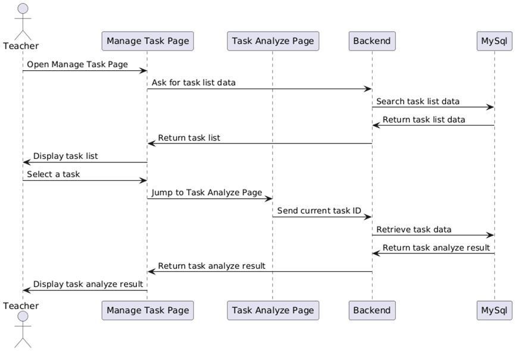
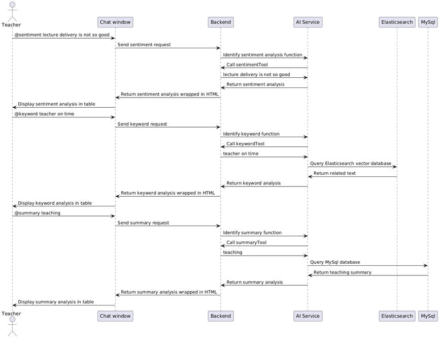

# 智能反馈分析平台

一个帮助教师自动化分析学生文本反馈的网站平台，运用大语言模型（AIGC）和自然语言处理技术生成分析结果，并实现一个AI聊天框，支持用户与AI交互以获得更深入的数据洞察。

基于jdk17，SpringBoot构建后端，使用MySQL和MyBatis进行数据持久化，通过easyexcel解析XLSX格式数据，支持最多1000条反馈数据的自动导入与分析。基于nodejs v18.18.0Element-Ui和Vue构建前端页面，并利用ECharts生成可视化图表。

## 设计图

## 创建任务功能

教师在”创建任务“页面上传传数据集到后端，后端解析文件中的模块返回前端，教师在前端选择模块，创建任务，发送表单给后端，后端先发送“任务创建成功”信息给前端再展示给用户。接着后端将选择后的数据集发送StanfordCoreNlp分析情绪，StanfordCoreNlp分析好返回后端，后端将情绪分析结果存入MySql数据库。后端将选择后的数据集发送ai服务让ai总结，ai服务返回总结报告，后端将总结报告存MySql数据库。后端将选择后的数据集发送ai服务，ai将文本向量化，并将向量化的文本返回后端，后端把向量化文本存入向量ElasticSearch数据库。

在这个流程中用户创建了任务，系统分析了数据集并把分析结果存入数据库。后面当用户想要通过各种形式查看分析结果的时候，后端可以结合数据库的数据和特殊函数快速地返回分析结果。

## 管理任务功能

当用户创建任务后，点击左侧导航栏的“管理任务”，会立刻向后端请求已创建任务列表的数据。查出所有任务的信息然后回显到前端。用户选择在任务列表中选择一个任务，即可跳转到该任务的分析页面。

## AI对话功能

用户发送信息“@sentiment lecture delivery is not so good”到聊天窗，聊天窗将信息传到后端，后端访问ai服务，ai服务识别出是情绪分析功能，调用后端的sentimentTool指令，后端sentimentTool又将lecture delivery is not so good传到ai服务，ai返回情绪分析内容到后端，后端用html标签包裹内容返回到聊天框，渲染表格展示在聊天窗。

用户发送信息”@keyword+teacher on time“到聊天窗，聊天窗将信息传到后端，后端访问ai服务，ai服务识别出是关键词功能，调用后端的keywordTool指令，后端keywordTool又将teacher on time传到ai服务，ai服务查询Elasticsearch向量数据库，Elasticsearch向量数据库返回相关文本反馈给ai，ai再返回给后端，后端用html标签包裹内容返回到聊天框，渲染表格展示在聊天窗。

 用户发送信息“@summary teaching”到聊天窗，聊天窗将信息传到后端，后端访问ai服务，ai服务识别出是总结功能，调用后端的summaryTool指令，后端summaryTool又将teaching传到ai服务，ai服务查询MySql数据库，MySql数据库teaching模块的总结给ai，ai返回后端，后端用html标签包裹内容返回到聊天框，渲染表格展示在聊天窗。

 